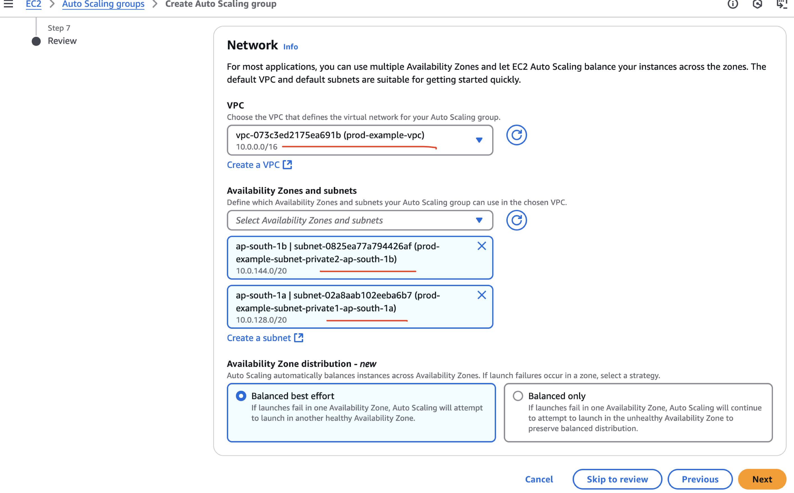
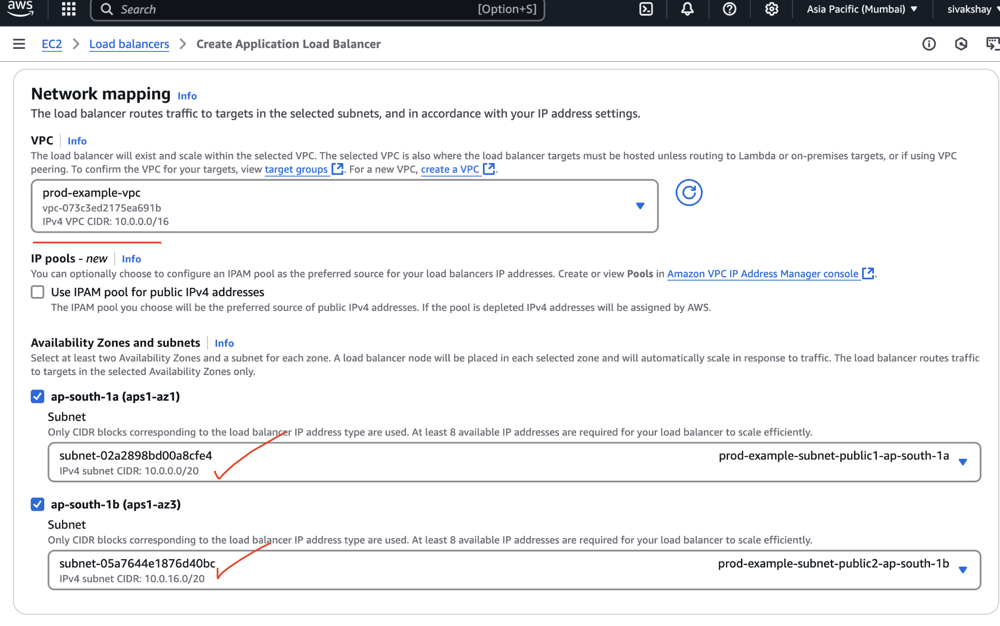

# vpc-prod-nat-setup

In this project, I designed and deployed a production-level VPC setup on AWS from scratch, focusing on best practices for **security**, **scalability**, and **high availability**.  

## 🔑 Key Components

- ✅ **Custom VPC** with public and private subnets across two Availability Zones  
- ✅ **Internet Gateway** and **dual NAT Gateways** for secure outbound internet access  
- ✅ **Bastion Host** setup to securely access private EC2 instances  
- ✅ **Launch Template** & **Auto Scaling Group** for dynamic instance management  
- ✅ **Application Load Balancer (ALB)** configured to distribute traffic to private instances  
- ✅ **Sample web application** deployed on port 8000 inside private subnets  
- ✅ **Security Groups** and **Route Tables** configured for controlled traffic flow  


## Step 1: Create the VPC

To create the VPC, follow these steps:

1. Open the AWS Management Console.
2. Navigate to the **VPC Dashboard**.
3. Click on **Create VPC**.
4. Provide the following details:


5. Click **Create VPC** to finalize

6. Wait for the VPC creation process to complete


## Step 2: Examine the Created VPC

Let’s take a closer look at the components that were created within the VPC:

### 🌍 Subnets (4 Total)
Subnets are segments within the VPC that divide it into smaller networks. These are in two Availability Zones (AZs) for redundancy:

### Availability Zone: ap-south-1a
- `prod-example-subnet-public1-ap-south-1a`: Public subnet (accessible from the internet)
- `prod-example-subnet-private1-ap-south-1a`: Private subnet (no direct internet access)

### Availability Zone: ap-south-1b
- `prod-example-subnet-public2-ap-south-1b`: Public subnet
- `prod-example-subnet-private2-ap-south-1b`: Private subnet

---

### 🛣️ Route Tables
Route tables control where traffic goes within the VPC.

- `prod-example-rtb-public`:  Associated with both public subnets; routes include access to the internet via the Internet Gateway.
- `prod-example-rtb-private1-ap-south-1a`: Associated with the private subnet in `ap-south-1a`.
- `prod-example-rtb-private2-ap-south-1b`: Associated with the private subnet in `ap-south-1b`.

---

### 🌐 Network Connections (3 Total)
- **`prod-example-igw`**: Internet Gateway – allows public subnets to communicate with the internet.
- **`prod-example-nat-public1-ap-south-1a`**: NAT Gateway – allows private subnet in AZ 1a to initiate outbound traffic (e.g., software updates) to the internet.
- **`prod-example-nat-public2-ap-south-1b`**: Same as above for AZ 1b.


## Step 3: Create a Launch Template

A launch template specifies the configuration for EC2 instances in the Auto Scaling Group.

1. Open the AWS Management Console.
2. Navigate to the **EC2 Dashboard**.
3. Click on **Launch Templates** in the left-hand menu.
4. Click **Create Launch Template**.
5. Provide the following details:
    - **Launch Template Name**: `prod-example-launch-template`
    - **AMI ID**: Select an appropriate Amazon Machine Image (e.g., Amazon Linux 2).
    - **Instance Type**: Choose an instance type (`t2.micro`).
    - **Key Pair**: Select an existing key pair or create a new one.
    - **Security Groups**: Create new securty group and its VPC is selected to the one we created which is `prod-example-vpc`.
        Also configure inbound security group rules to allow SSH access on port 22 and application access on port 8000.

6. Click **Create Launch Template** to save.


---

## Step 4: Create an Auto Scaling Group

An Auto Scaling Group ensures that the desired number of EC2 instances are running.

1. Navigate to the **Auto Scaling Groups** section in the EC2 Dashboard.
2. Click **Create Auto Scaling Group**.
3. Provide the following details:
    - **Auto Scaling Group Name**: `prod-example`
    - **Launch Template**: Select the launch template created earlier `prod-example-launch-template`
    - **VPC and Subnets**: Select the VPC created in Step 1 and ensure that the private subnets are chosen, as the instances will be hosted in private subnets to enhance security.
    
    
4. Configure the scaling policies:
    - **Desired Capacity**: 2
    - **Minimum Capacity**: 1
    - **Maximum Capacity**: 4
5. Add health checks and notifications if required.
6. Review and click **Create Auto Scaling Group**.

---

## Step 5: Verify the Auto Scaling Group

1. Check the **Instances** tab to ensure EC2 instances are launched.

2. Verify that instances are distributed across the selected subnets
3. Select one of the EC2 instances and verify its **Subnet ID**:
    - Navigate to the **Instances** section in the EC2 Dashboard.
    - Select an instance from the list.
    - In the **Details** tab, locate the **Subnet ID** field.
    - Confirm that the Subnet ID matches one of the private subnets:
        - `prod-example-subnet-private1-ap-south-1a`
        - `prod-example-subnet-private2-ap-south-1b`

    


### Step 6: Accessing Private EC2 Instances via a Bastion Host

Since the EC2 instances are in private subnets, they do not have public IP addresses for direct access. To connect to these instances, we need to set up a Bastion Host (or Jump Host) in a public subnet. Follow these steps:

#### Step 1: Launch a Bastion Host
1. Open the AWS Management Console.
2. Navigate to the **EC2 Dashboard**.
3. Launch a new EC2 instance in one of the public subnets of the VPC created earlier.
4. Configure the instance with the following:
    - **AMI ID**: Select an appropriate Amazon Machine Image (e.g., Amazon Linux 2).
    - **Instance Type**: Choose an instance type (`t2.micro`).
    - **Key Pair**: Use the same key pair as the private EC2 instances or create a new one.
    - **Security Group**: Create a security group that allows SSH access (port 22) from your local machine's IP address.
    - **VPC**: Choose our VPC `prod-example-vpc`

    


#### Step 2: Connect to the Bastion Host
1. Obtain the public IP address of the Bastion Host:
2. Use the following SSH command to connect to the Bastion Host:
    ```bash
    ssh -i <your-key-file>.pem ec2-user@<public-ip-address>
    ```
    Replace `<your-key-file>.pem` with the name of your private key file and `<public-ip-address>` with the public IP address of the Bastion Host.
3. To access the private EC2 instances, ensure the `.pem` file (private key) is copied to the Bastion Host. This allows secure  SSH connections to the private instances from the Bastion Host.

    

#### Step 3: Access Private EC2 Instances via the Bastion Host
1. Once connected to the Bastion Host, use SSH to connect to the private EC2 instances:
    ```bash
    ssh -i <your-key-file>.pem ec2-user@<private-ip-address>
    ```
    Replace `<private-ip-address>` with the private IP address of the target EC2 instance.

    

> **Note:** Ensure that the security group of the private EC2 instances allows SSH access from the Bastion Host's private IP address.

By using a Bastion Host, you can securely access EC2 instances in private subnets without exposing them to the public internet.


## Step 6: Run a sample application in your ec2 instance

To run a sample application on your EC2 instance, follow these steps:

1. **Create an HTML file**:
    - SSH into your private EC2 instance via the Bastion Host.
    - Create a file named `index.html`:
      ```bash
      vi index.html
      ```
    - Add the following content to the file:
      ```html
      <!DOCTYPE html>
      <html>
      <body>

      <h1>AWS POC production VPC</h1>
      <p>This project provides a detailed explanation of setting up a production-level VPC.</p>

      </body>
      </html>
      ```

2. **Start a Python HTTP server**:
    - Run the following command to start a simple HTTP server on port 8000:
      ```bash
      python3 -m http.server 8000
      ```
## Step 7: Create a Load Balancer

A Load Balancer distributes incoming traffic across multiple targets, such as EC2 instances, in different Availability Zones.

1. Navigate to the **Load Balancers** section in the EC2 Dashboard.
2. Click **Create Load Balancer**.
3. Select **Application Load Balancer** and click **Create**.
4. Provide the following details:
    - **Name**: `prod-example-alb`
    - **Scheme**: Internet-facing
    - **IP Address Type**: IPv4
    - **Listeners**: Add a listener for HTTP on port 80.
    - **Availability Zones**: Select the VPC created earlier and choose the public subnets.

    

5. Configure the **Security Groups**:
    - select a security group we already created `prod-example-security-group`

6. Configure the **Target Group**:
    - Create a new target group:
        - **Target Type**: Instances
        - **Name**: `prod-example-target-group`
        - **Protocol**: HTTP
        - **Port**: 8000
        - **VPC**: Select the VPC created in the earlier steps.
        - Register the private EC2 instances as targets.

    

    > **Note:** Since the Python application is running on only one EC2 instance, the other instances may appear as unhealthy in the target group.

7. Review and click **Create Load Balancer**

    Our Loadbalancer is ready!!

     
---

## Step 8: Access

1. Once the Load Balancer is created, note its **DNS Name**.
2. Open a browser and navigate to the Load Balancer's DNS Name.
3. You should see the sample application running on the private EC2 instances.


By using a Load Balancer, you ensure high availability and fault tolerance for your application.
